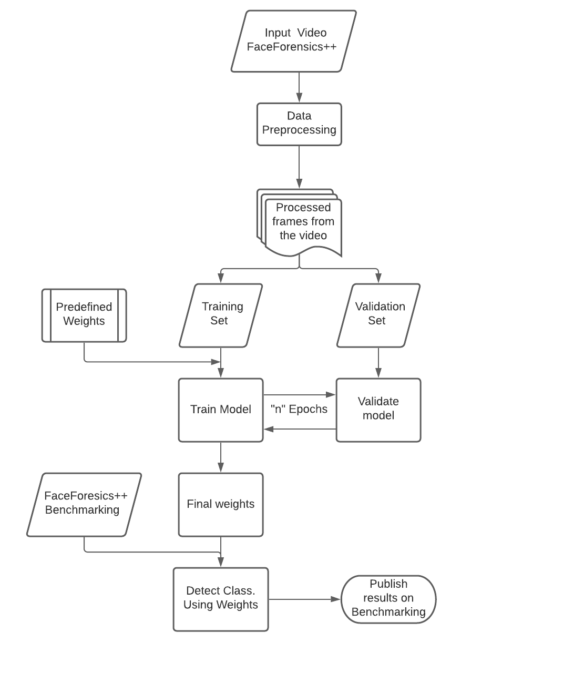
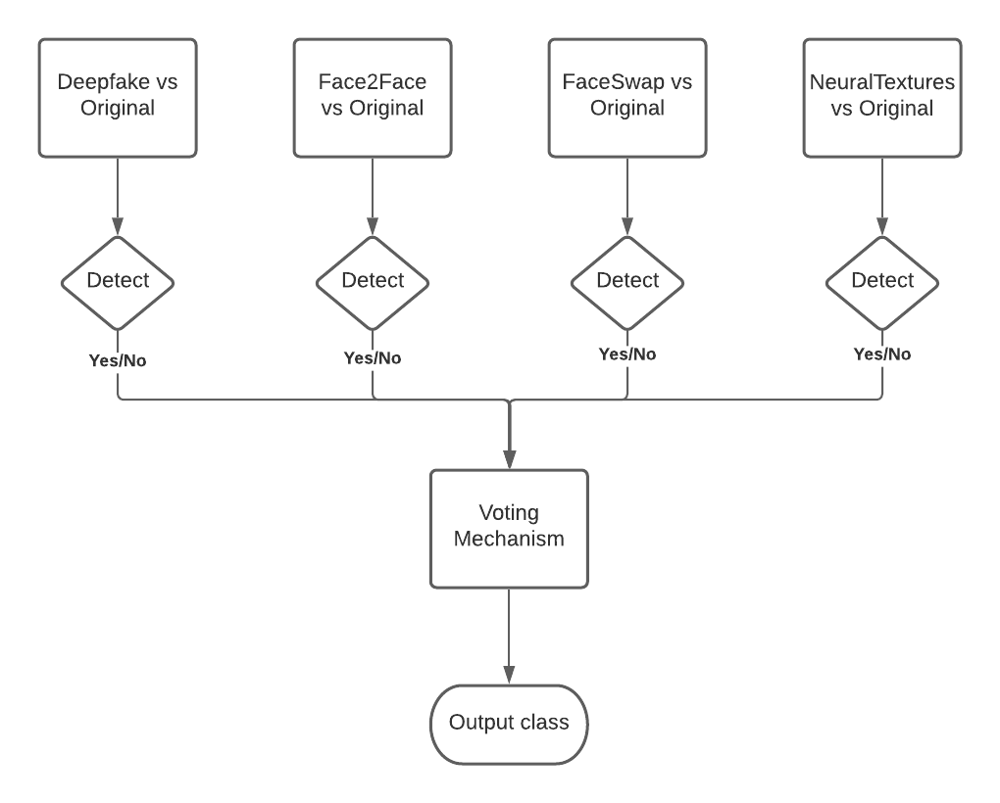
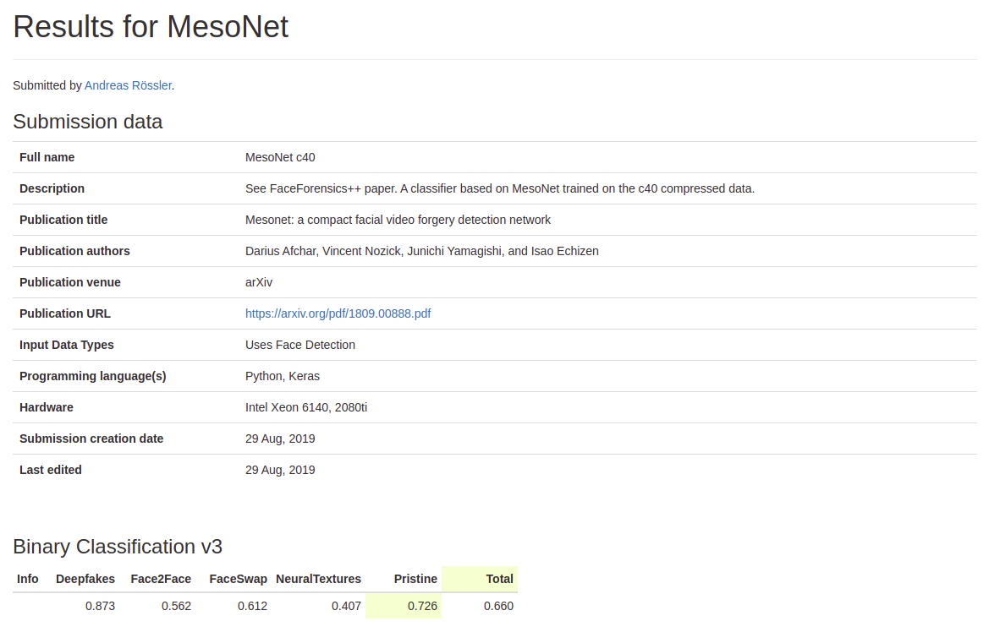
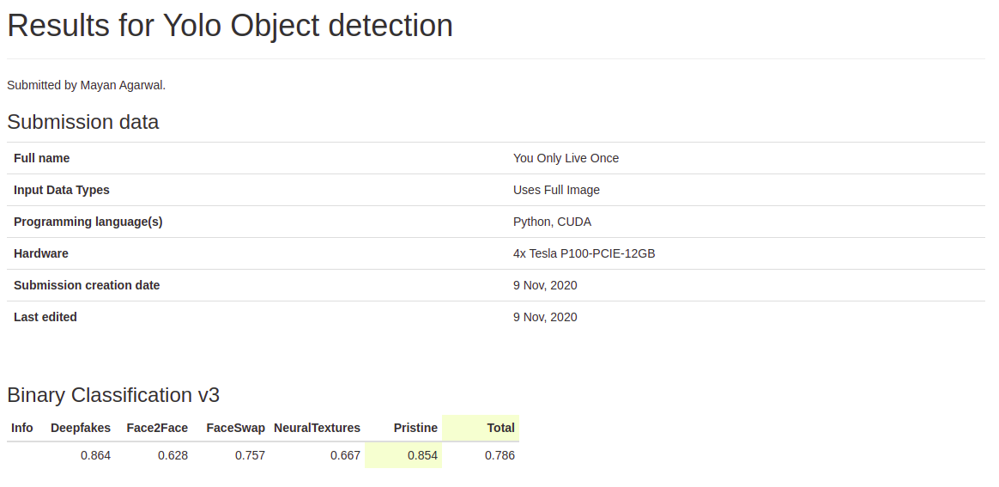
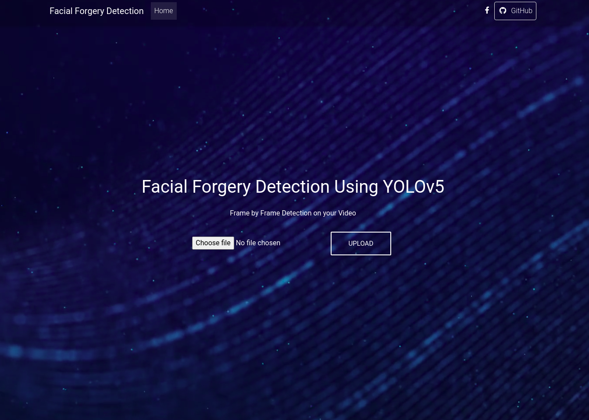

# COM_COM_000166-Deepfake-Detection

Please find further details about MesoNet and YOLOv5 in the respective folders.

## Process Flow

### Data PreProcessing

### Voting Mechanism

## RESULTS

[Accuracy_all5](Results/image39.png)

[Accuracy_individual](Results/image32.png)

We have publised the reults of YOLOv5 on the here -
http://kaldir.vc.in.tum.de/faceforensics_benchmark/

### MesoNet Benchmarking

### YOLOv5 Benchmarking

### YOLOv5 with Voting Mechanism Benchmarking

## Front End

In the YOLOv5 directory, one can simply execute `python3 app.py` to run flask server and launch site on localhost.

